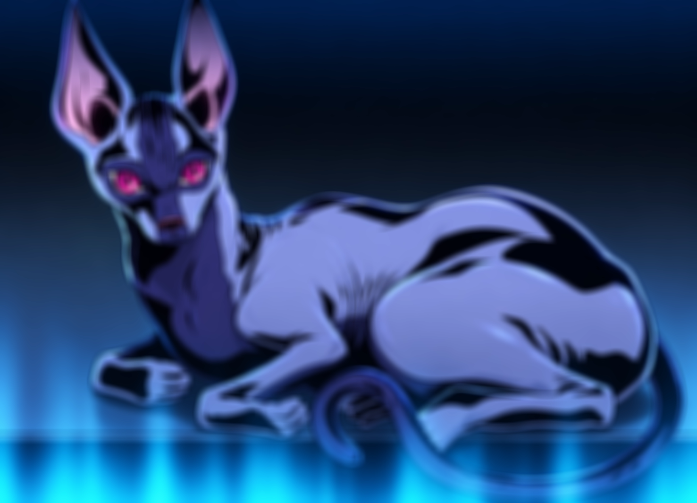

# BLUR-04 — разделимый Gaussian по Y/U/V

Статус: DONE как измерительный эксперимент. Pixel 3 `8B1X11QLW`, Android 12,
Release/AOT. Основа — `bbe8de52c4c5379896b7ac3a0d069b0cf73ac954`; production C/ABI
не менялись. [Кандидатный patch](blur04_gaussian_separable.patch) включает
изолированный direct YUV путь BLUR-03 и разделимый путь BLUR-04, ограниченный
tight full-frame NV12, `radius=10`, `sigma=10`. SHA-256 итогового C-файла:
`1205408a02b8124b8c1818709140f00f7886c3cf99fba7a5673de2215af3bb29`.

## Метод

Горизонтальный проход считает double промежуточные значения в кольце строк;
вертикальный проход берёт строки из кольца и округляет только итоговый байт.
Для Y используются `r=10, sigma=10`, для U/V — `r=5, sigma=5`, как в BLUR-03.
Обрабатываются края с clamp. Полный промежуточный кадр не выделяется.

Сравнивались текущий RGB, direct 2D Y/U/V из BLUR-03 и разделимый Y/U/V.
Один публичный Dart вызов на образец; PNG decode, подготовка NV12 и clone
исходника вне таймера. Каждый запуск — 2 warmup и 7 измерений на каждом
размере. Для direct YUV и разделимого варианта выполнено по два независимых
запуска (14 samples на размер); RGB — один запуск (7 samples). В таблице для
YUV вариантов медиана рассчитана по объединённым raw samples.

| Вход | RGB | Direct 2D Y/U/V | Separable Y/U/V | Separable против 2D |
| --- | ---: | ---: | ---: | ---: |
| 1477×1065 | 1428.273 ms | 937.816 ms | **186.225 ms** | **5.04× быстрее, −80.14%** |
| 720×360 | 224.182 ms | 147.547 ms | **28.783 ms** | **5.13× быстрее, −80.49%** |

Сравнение с RGB: разделимый вариант быстрее в 7.67×/7.79× соответственно.
В абсолютных значениях он экономит 1242.048 ms/195.399 ms относительно RGB
и 751.591 ms/118.764 ms относительно direct YUV 2D. На 720×360 28.783 ms всё
ещё больше 16.7 ms бюджета кадра при 60 fps.

Raw JSONL с отдельными samples:

- [RGB](blur04_raw/rgb/20260926-014137-gaussian.jsonl)
- [Direct Y/U/V, запуск 1](blur04_raw/yuv/20260926-014046-gaussian.jsonl)
- [Direct Y/U/V, запуск 2](blur04_raw/yuv/20260926-014225-gaussian.jsonl)
- [Separable Y/U/V, запуск 1](blur04_raw/separable/20260926-014450-gaussian.jsonl)
- [Separable Y/U/V, запуск 2](blur04_raw/separable/20260926-014531-gaussian.jsonl)

## Точность и изображение

Оба 720×360 result SHA для direct и separable совпали:
`f827cbf2b023bf4680dfa270bfe0f4700d410a40c10cf9c3008297717ad6e600`.
Для 1477×1065 совпали SHA и полные сохранённые NV12 bytes:
`8c66d9c886d6e9c274cee10cf97a4cdfa6dcfd5ec5c5221131907d8f294b670d`;
2,360,779 байт, 0 отличающихся байтов, максимальная абсолютная разница 0.
Raw: [direct Y/U/V](blur04_raw/yuv/20260926-014225-gaussian-yuv.nv12),
[separable Y/U/V](blur04_raw/separable/20260926-014531-gaussian-separable.nv12).

Равенство подтверждено для двух тестовых изображений и этих параметров; оно
не доказывает byte-exact равенство для любого входа, sigma или radius. Прямой
и разделимый расчёты меняют порядок операций с double, поэтому нужны отдельные
случайные/краевые тесты до общего production пути. Здесь проверен полный кадр
и его края; ROI и padded strides не проверялись. Текущий RGB byte-oracle не
ослаблялся: кандидат сохраняет семантику direct YUV BLUR-03.

## Временная память

Scratch — double-кольцо `min(height, 2r+1) × width`, повторно используемое
для Y, U и V. Для 1477×1065/r10: `1477 × 21 × 8 = 248,136` байт (242.3 KiB).
Для 720×360/r10: 120,960 байт (118.1 KiB). Оценка для luma 4000×3000/r256:
`4000 × 513 × 8 = 16,416,000` байт (15.66 MiB). Это scratch алгоритма,
без исходного и выходного изображений и 513 double весов на стеке; оценка
памяти для r256 не означает, что этот isolated candidate уже принимает r256.

Во время проверки сравнение raw-буферов выявило пропущенную нормализацию во
втором проходе. Такой промежуточный прогон дал испорченное изображение и в
результатах не учитывается. После исправления C прошёл `clang -std=c11
-Wall -Wextra -Werror -fsyntax-only`; runner прошёл `flutter analyze` и два
Release/AOT запуска. Результаты и PNG относятся только к исправленной версии.

Кандидат показывает достаточный выигрыш для отдельного production-переноса
с полной проверкой ABI/layout/ROI/fallback и тестами на разных кадрах. Такой
перенос в этой задаче не выполнялся.
